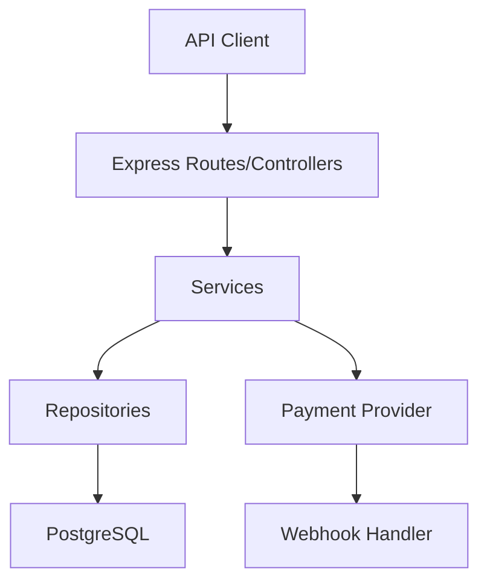
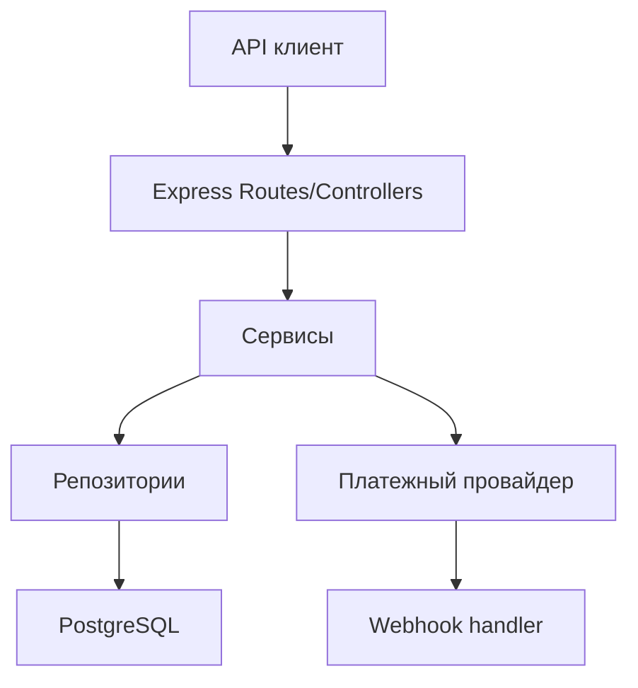

# BillingService

## English
## Problem
SaaS products need a clear billing backend for plans, subscriptions, payments, and webhook processing.
## Solution
BillingService implements a layered Node.js backend with Drizzle + PostgreSQL and payment-provider abstraction.
## Tech Stack
- Node.js, TypeScript
- Express
- PostgreSQL
- Drizzle ORM
- Zod
## Architecture
```text
src/
src/modules/
src/providers/
src/webhooks/
src/db/
```

## Features
- Subscription and payment flows
- Webhook handling with signature validation
- Layered architecture (controller/service/repository/provider)
- Migration + seed support
## How to Run
```bash
npm install
cp .env.example .env
npm run db:migrate
npm run dev
```

## Русский
## Проблема
SaaS-продукту нужен понятный billing backend для тарифов, подписок, платежей и обработки вебхуков.
## Решение
BillingService реализует слоистый backend на Node.js с Drizzle + PostgreSQL и абстракцией платежного провайдера.
## Стек
- Node.js, TypeScript
- Express
- PostgreSQL
- Drizzle ORM
- Zod
## Архитектура
```text
src/
src/modules/
src/providers/
src/webhooks/
src/db/
```

## Возможности
- Потоки подписок и платежей
- Обработка вебхуков и валидация подписи
- Слоистая архитектура (controller/service/repository/provider)
- Миграции и seed-данные
## Как запустить
```bash
npm install
cp .env.example .env
npm run db:migrate
npm run dev
```
